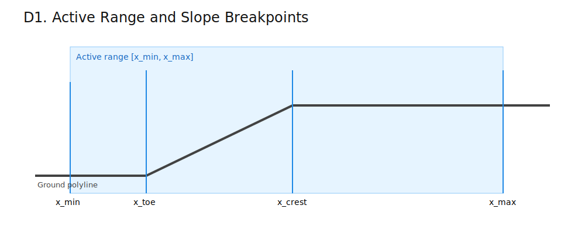
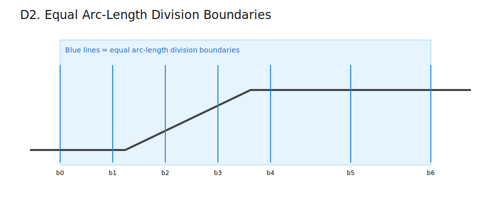
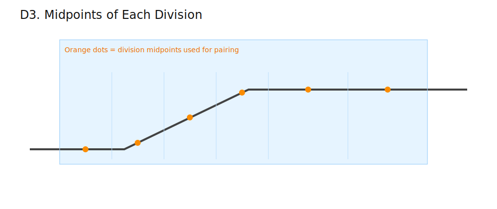
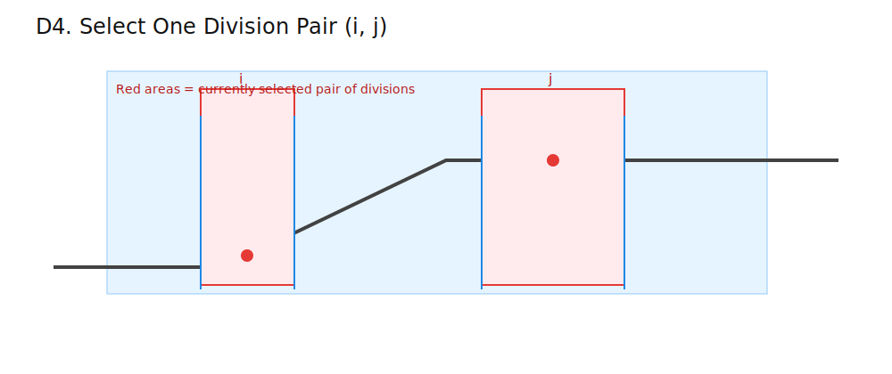
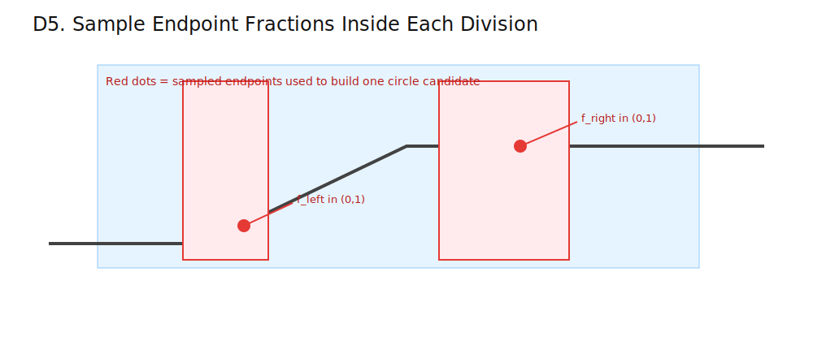
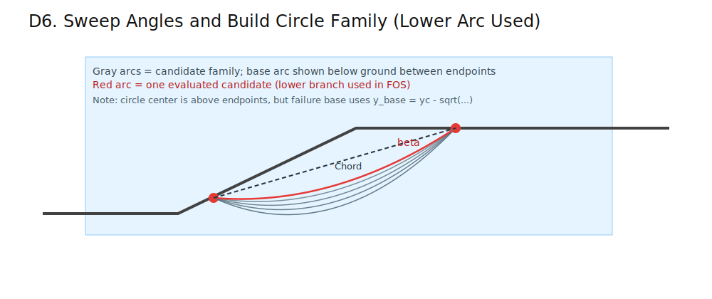
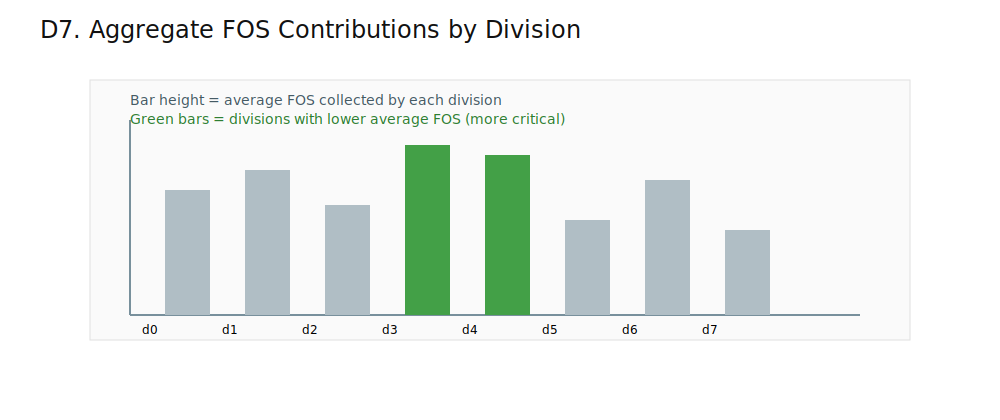
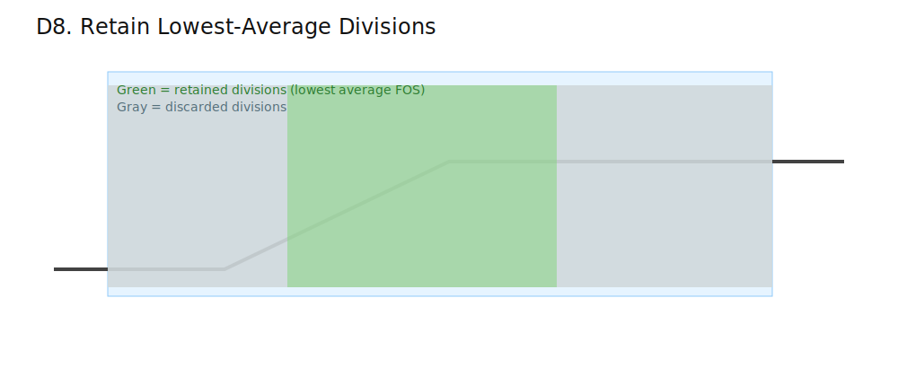
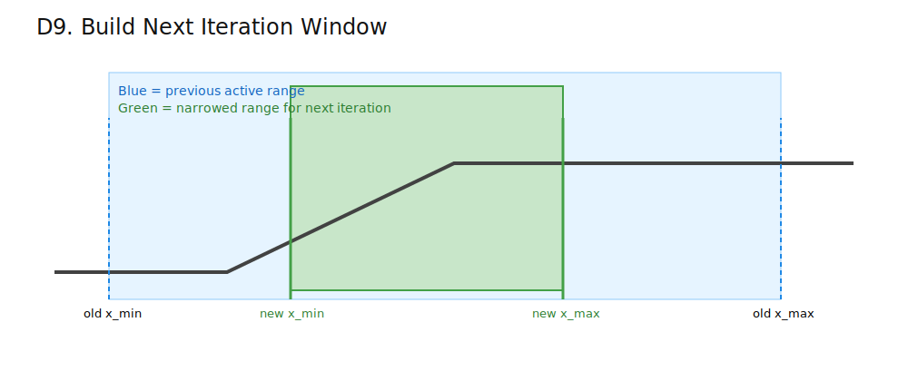
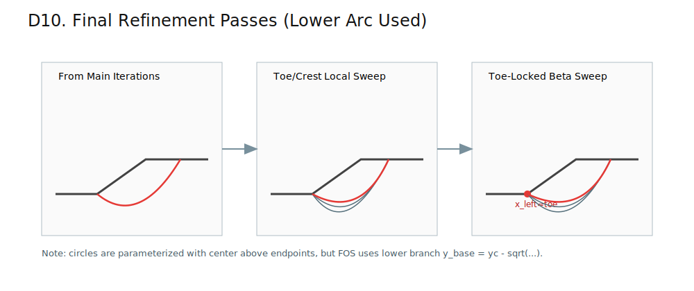

# Auto-Refine Circular Search Explained (Super Simple)

This document explains the current implementation in `src/slope_stab/search/auto_refine.py`.
Shared circular geometry helpers used by search paths live in `src/slope_stab/search/common.py`.

Goal in one sentence: try many circular slip surfaces, keep the most critical zone, repeat, then do final local refinements.

## Legend (Used in All Diagrams)

- Ground polyline: dark gray (`#424242`)
- Active range: light blue (`#E6F4FF`)
- Division boundaries: blue (`#1E88E5`)
- Division midpoints: orange (`#FB8C00`)
- Selected pair `(i, j)`: red (`#E53935`)
- Retained divisions: green (`#43A047`)
- Discarded divisions: muted gray (`#B0BEC5`)

## Division Process: Diagram by Diagram

### D1. Active range and breakpoints

Short description: start with the current horizontal search window and include slope breakpoints (`x_toe`, `x_crest`) inside it.

Formulas:

`x_crest = x_toe + L`  
`x_min = x_toe - H`  
`x_max = x_crest + 2H`

- What this computes: crest location and default search limits.
- Where it is used in our implementation: initial and per-iteration active range setup.
- Why it matters for Case 3/Case 4 parity: wrong window means wrong candidate families.

### D2. Equal arc-length division boundaries

Short description: split the active ground polyline into equal-length chunks (by distance along the line, not by x only).

Formulas:

`s_total = sum(sqrt((x_{k+1}-x_k)^2 + (y_{k+1}-y_k)^2))`  
`s_boundary(i) = (i / divisions) * s_total`

- What this computes: total polyline arc length and each boundary target distance.
- Where it is used in our implementation: `_cumulative_lengths`, `_point_at_arc_length`, `_division_boundaries_and_midpoints`.
- Why it matters for Case 3/Case 4 parity: equal-arc segmentation controls where candidates are sampled.

### D3. Midpoints of each division

Short description: get one representative midpoint per division; these are used to define division pairs.

Formula:

`s_mid(i) = ((i + 0.5) / divisions) * s_total`

- What this computes: arc-length location of each division midpoint.
- Where it is used in our implementation: midpoint array in `_division_boundaries_and_midpoints`.
- Why it matters for Case 3/Case 4 parity: midpoint geometry affects pair slope and candidate angles.

### D4. Select a division pair `(i, j)`

Short description: choose two different divisions (`i < j`) to form one pair for candidate generation.

Formula:

`pairs = divisions * (divisions - 1) / 2`

- What this computes: total number of unique division pairs.
- Where it is used in our implementation: nested loops `for i ... for j in range(i+1, ...)`.
- Why it matters for Case 3/Case 4 parity: pair count directly sets search breadth.

### D5. Fix one midpoint endpoint pair per selected division pair

Short description: for each selected pair `(i, j)`, use midpoint endpoints directly and keep them fixed while sweeping beta for that pair.

Formula:

`P_left = midpoint(i)`  
`P_right = midpoint(j)`

- What this computes: deterministic fixed endpoints for each pair.
- Where it is used in our implementation: midpoint array from `_division_boundaries_and_midpoints` and the pre-polish pair loop in `run_auto_refine_search`.
- Why it matters for Slide2 alignment: `.s01` emits repeated fixed-endpoint groups with beta sweeps per group.

### D6. Sweep angle and build circle family

Short description: for each pair, sweep through `circles_per_division` angles and build candidate circles through fixed midpoint endpoints; the plotted/used failure arc is the lower branch through the slope mass.

Formulas:

`theta_chord = atan2(y_right - y_left, x_right - x_left)`  
`beta_max = pi/2 - theta_chord`  
`beta_m = (m / N) * beta_max`, for `m = 1..N`

`c = sqrt((x2-x1)^2 + (y2-y1)^2)`  
`r = c / (2 * sin(beta))`  
`d = c / (2 * tan(beta))`

- What this computes: chord length, circle radius, and center offset for one candidate.
- Where it is used in our implementation: `circle_from_endpoints_and_tangent`, `_generate_slide2_betas`.
- Why it matters for Slide2 alignment: this stage now matches the recovered Slide2 per-pair linear beta schedule.

Important implementation detail:
- Circles are parameterized with center above the endpoints (`yc > max(y1, y2)` in `circle_from_endpoints_and_tangent`).
- FOS uses the lower arc branch in `CircularSlipSurface.y_base`: `y_base = yc - sqrt(r^2 - (x - xc)^2)`.

### D7. Aggregate FOS by division

Short description: each valid surface contributes its FOS to both incident divisions; then per-division averages are computed.

Formula:

`avg_fos(i) = sum(FOS values touching division i) / count(values touching i)`

- What this computes: average FOS score per division.
- Where it is used in our implementation: `division_fos` lists and average computation in `run_auto_refine_search`.
- Why it matters for Case 3/Case 4 parity: retained region depends on these averages.

### D8. Retain lowest-average divisions

Short description: keep the most critical divisions (lowest average FOS), deterministic tie-break by index.

Formula:

`keep = ceil(divisions * retain_pct / 100)`

- What this computes: number of divisions kept for next iteration.
- Where it is used in our implementation: `keep_count`, ranking by `(avg_fos, index)`.
- Why it matters for Case 3/Case 4 parity: governs how aggressively search narrows each iteration.

### D9. Build the next iteration window

Short description: convert retained divisions to a new x-window and continue iterating.

Formulas:

`next_x_min = min(boundary[idx].x for idx in retained)`  
`next_x_max = max(boundary[idx+1].x for idx in retained)`

- What this computes: narrowed horizontal search limits for the next iteration.
- Where it is used in our implementation: `next_x_min`, `next_x_max` update logic.
- Why it matters for Case 3/Case 4 parity: narrowing controls where final minima are found.

### D10. Final refinement passes

Short description: after iterations, run three deterministic local refinements; all evaluate the lower arc branch through the slope mass.

Formulas:

`beta_samples_toe_crest = max(11, circles_per_division + 1)`  
`beta_samples_toe_locked = 121`  
`beta_k = beta_lo + (beta_hi - beta_lo) * u_k`

- What this computes: angle sampling for the final local sweeps.
- Where it is used in our implementation: `_run_toe_crest_refinement`, `_run_toe_locked_beta_refinement`, and `_run_toe_locked_local_xright_beta_polish`.
- Why it matters for Case 3/Case 4 parity: these passes tighten the final minimum and were key for Case 4 agreement.

Important implementation detail:
- The refinement passes create circles by center/radius geometry.
- The solver still evaluates the lower branch base (`y_base = yc - sqrt(...)`), not an upper arc above ground.
- Post-polish right-endpoint search uses a deterministic crest window upper bound of `x_crest + 0.38H` (clamped to configured `search_limits.x_max`).

## Before vs After Post-Polish Metadata

Auto-refine metadata publishes both stages explicitly:

- `search.before_post_polish`: winner snapshot at the end of the core iterative search, before any post-polish refinement pass.
- `search.after_post_polish`: final/top-level winner after refinement passes.

Each stage includes:

- `fos`
- `surface` (`xc`, `yc`, `r`, `x_left`, `y_left`, `x_right`, `y_right`)

This enables direct reporting of pre-refinement versus post-refinement behavior without changing the top-level output contract.

## Slide2 Comparison Artifacts

Case2_Search and Case4 Slide2 parity evidence (both solvers) is published under:

- `docs/benchmarks/auto_refine_slide2_case2_case4_new.json`
- `docs/benchmarks/auto_refine_post_polish_ab.json`
- `docs/benchmarks/auto_refine_post_polish_ab.md`

## Solver Validity Rules Used by Search

- A candidate surface is invalid if any slice has final-iteration `m_alpha < 0.2`.
- The `m_alpha` threshold is checked only on the converged/final solver iteration (Bishop or Spencer).
- Base tension induced negative shear strength is clamped to zero during resistance aggregation.

## Case2/Case4 Hard Parity Gates

For Slide2 Case2_Search and Case4 (Bishop + Spencer), hard gates apply to the final auto-refine output (`after_post_polish`):

Thresholds:

`fos_abs_error = abs(FOS_model - FOS_ref) <= 0.005`  
`endpoint_abs_error = abs(coord_model - coord_ref) <= 0.30 m`  
`radius_rel_error = abs(r_model - r_ref) / r_ref <= 12%`

Reference source is `rfcreport` global-minimum geometry/FOS for each case/method.

## Post-Polish Removal Policy

Post-polish may only be removed if no-post-polish A/B evidence passes the same hard gates above for Case2_Search and Case4 (both Bishop and Spencer), and the full repository gate remains green:

- `python -m slope_stab.cli verify`
- `python -m slope_stab.cli test`

`cli verify` now defaults to auto-parallel case scheduling; use `python -m slope_stab.cli verify --serial` for canonical serial debugging.

## Deterministic Behavior (No Random Seed Path)

This implementation is deterministic because ordering is fixed for:
- division pair generation
- angle generation
- tie-break key (`x_left`, `x_right`, `r`)

No random-seed field is used for this auto-refine path.

## Parallel Candidate Scoring (`auto` by Default)

`search.parallel.mode` controls evaluation mode:
- `auto` (default) resolves serial vs parallel deterministically from static policy evidence.
- `serial` forces serial evaluation.
- `parallel` forces parallel evaluation.

`workers=0` resolves deterministically to `min(4, effective_cpu_count)`. Explicit worker counts are clamped to available CPU.

In auto mode, candidate circles may be scored in batches when policy thresholds are met and process workers are available. If the backend is thread-based, auto mode falls back to serial by default (v1 thread whitelist is intentionally empty).

The merge path remains ordered and deterministic: cache checks, budget limits, and incumbent updates follow the same logical order as serial evaluation. Worker failures (timeout, startup failure, invalid payload, runtime exception) raise explicit errors and abort the run.

## If Diagrams Do Not Render

If your viewer cannot render SVG/Mermaid, the formulas and text are still valid.
Use a Markdown viewer that supports both for best results.
