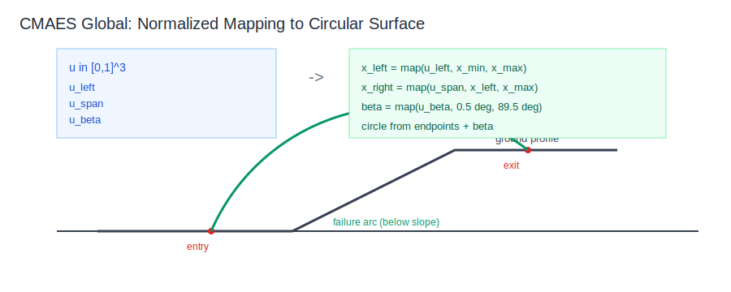
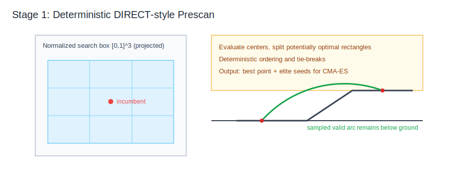
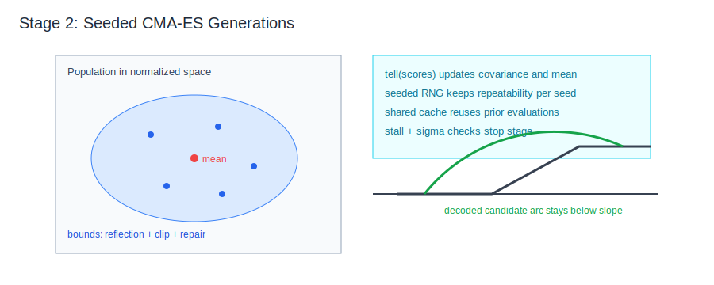
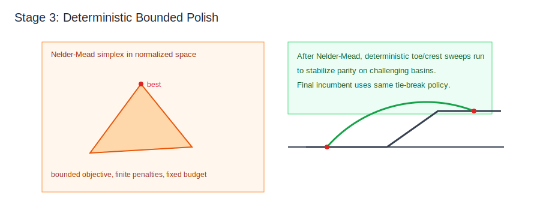
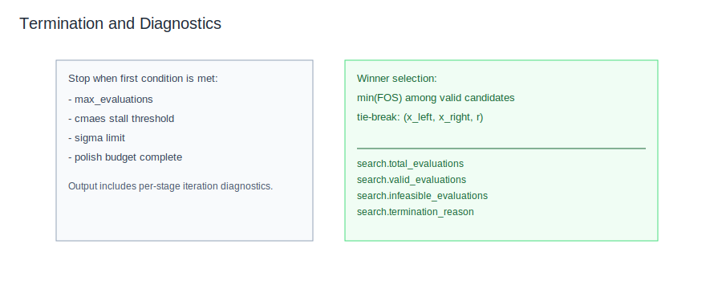
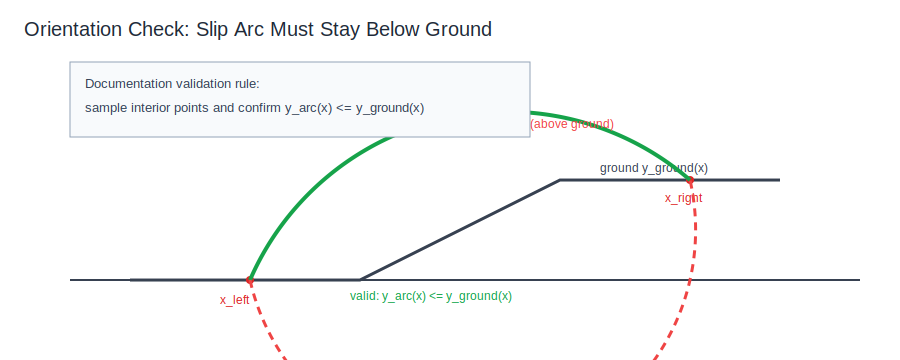

# CMAES Global Circular Search Explained

This document explains `search.method = "cmaes_global_circular"` in `src/slope_stab/search/cmaes_global.py`.
Core circular geometry, tie-break keys, and candidate validity checks are shared via `src/slope_stab/search/common.py`.
Objective/cache behavior is shared via `src/slope_stab/search/objective_evaluator.py`, and DIRECT prescan partition logic is shared via `src/slope_stab/search/direct_partition.py`.

## Goal

Find a low factor-of-safety circular slip surface using a hybrid pipeline:

1. deterministic DIRECT-style prescan in normalized space,
2. seeded CMA-ES refinement,
3. deterministic bounded polish.

The method is stochastic in the CMA stage and uses fixed seeds for reproducibility.
Expect numerically close repeat runs for the same seed (not strict bit-for-bit identity in all environments).
`cma` and `scipy` are required runtime dependencies for this path.

## Parameter Space

The method uses the same normalized circular mapping as other global methods:

- `u_left in [0,1]`
- `u_span in [0,1]`
- `u_beta in [0,1]`

with:

- minimum endpoint horizontal separation `0.05 m`
- `beta in [0.5 deg, 89.5 deg]`
- search bounded by `search_limits.x_min/x_max`.

## Hybrid Stages

### Stage 1: DIRECT-style Prescan

The algorithm partitions normalized space, evaluates rectangle centers, and keeps splitting potentially optimal rectangles. This stage is deterministic and builds strong initial elites. The partition primitive is the same one used by `direct_global_circular`.

### Stage 2: Seeded CMA-ES

CMA-ES starts from elites from prescan and explores correlated directions in normalized space. Bounds are enforced by reflection and clipping plus shared repair logic.

### Stage 3: Deterministic Polish

The best CMA vector is polished with bounded Nelder-Mead. Toe/crest refinement is then followed by a deterministic two-phase toe-locked sweep:

1. coarse `61 x 61` grid over toe-locked right-endpoint/beta space,
2. local `21 x 21` sweep centered on the best coarse cell.

### Termination and Selection

The final winner is the best valid surface found across all stages, with deterministic tie-break on `(x_left, x_right, r)`.

## Objective and Penalties

The shared objective cache/evaluator is used across all stages.

- valid converged candidate: `score = FOS`
- invalid geometry: `score = invalid_penalty` (large finite)
- nonconverged/invalid solver result: `score = nonconverged_penalty` (large finite)

Finite penalties are used (not `+inf`) for optimizer stability in CMA-ES and Nelder-Mead.

Solver validity details:
- candidate is invalid if any slice has final-iteration `m_alpha < 0.2`
- `m_alpha` threshold check is applied on the converged/final Bishop iteration
- base tension induced negative shear strength is clamped to zero

## Orientation Validation for SVGs

All documentation SVGs must depict slip arcs below the slope/ground line between endpoints.

Validation rule used for the figures:

`y_arc(x) <= y_ground(x)` for sampled interior points `x in (x_left, x_right)`.

Illustration of valid orientation:

## Output Diagnostics

`result.metadata.search` includes:

- config echo under `cmaes_global_circular`
- `total_evaluations`
- `valid_evaluations`
- `infeasible_evaluations`
- `termination_reason`
- `iteration_diagnostics` entries with:
  - `stage` (`direct`, `cmaes`, `polish`)
  - `iteration`
  - `total_evaluations`
  - `incumbent_fos`
  - `extra` (stage-specific fields)

## Typical Defaults

- `max_evaluations = 5000`
- `direct_prescan_evaluations = 300`
- `cmaes_population_size = 8`
- `cmaes_max_iterations = 200`
- `cmaes_restarts = 2`
- `cmaes_sigma0 = 0.15`
- `polish_max_evaluations = 80`
- `min_improvement = 1e-4`
- `stall_iterations = 25`
- `seed = 0`
- `post_polish = true`
- `invalid_penalty = 1e6`
- `nonconverged_penalty = 1e5`
