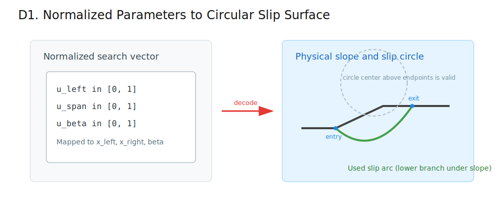
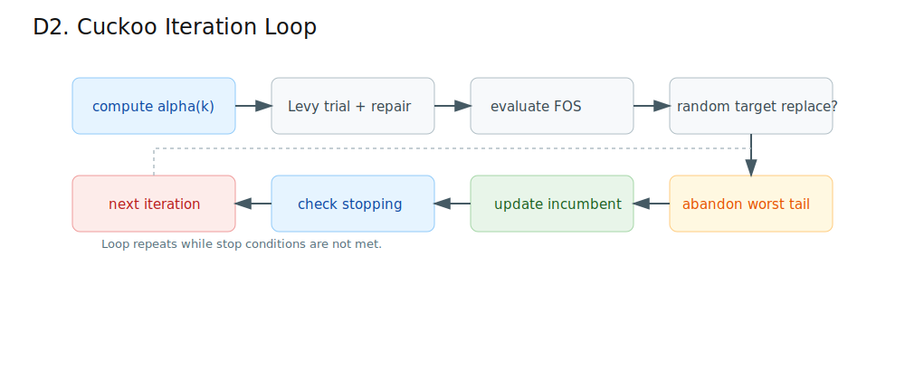
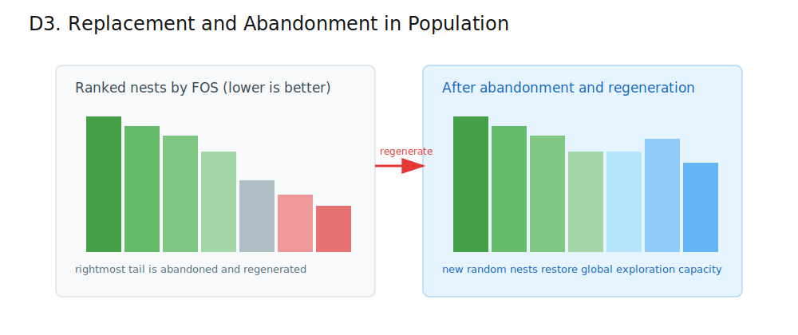
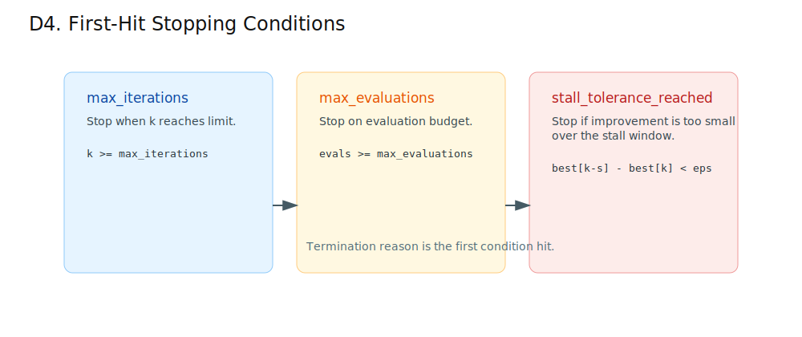
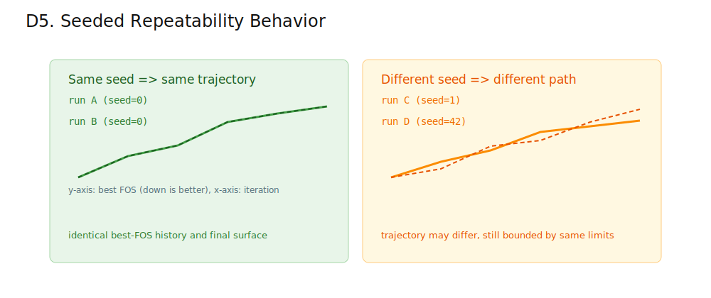
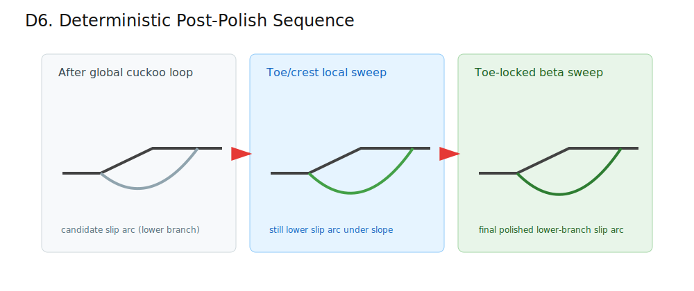

# Cuckoo Global Circular Search Explained

This document explains `search.method = "cuckoo_global_circular"` in `src/slope_stab/search/cuckoo_global.py`.
This method shares circular mapping, tie-break keys, and candidate validity checks via `src/slope_stab/search/common.py`.
Objective/cache/counter handling is shared via `src/slope_stab/search/objective_evaluator.py`.

## Goal

Find a low factor-of-safety circular slip surface with strong global exploration, while keeping repeatability when a fixed `seed` is used.

This method is stochastic. It does not provide a finite-iteration mathematical guarantee of the exact global minimum for this discontinuous objective.

## Parameter Space

The search works in normalized coordinates:

- `u_left in [0,1]`
- `u_span in [0,1]`
- `u_beta in [0,1]`

These map to a circular surface with:

- endpoint limits inside `search_limits.x_min/x_max`
- minimum horizontal endpoint separation `0.05 m`
- angle range `beta in [0.5 deg, 89.5 deg]`

Important orientation note:
- the plotted slip surface is the lower circular branch under the slope ground profile.
- both slip endpoints lie on the ground profile, with the right endpoint exiting at crest ground level in the diagrams.

Invalid geometries or failed solver evaluations are treated as `+inf` objective value.

Solver validity details:
- candidate is invalid if any slice has final-iteration `m_alpha < 0.2`
- this `m_alpha` threshold is checked on the final converged solver iteration (Bishop or Spencer)
- base tension induced negative shear strength is clamped to zero

## Iteration Flow

Each iteration:

1. Compute decaying step size `alpha` from `alpha_max` to `alpha_min`.
2. For each nest, generate a Levy-flight trial vector (Mantegna-style) and repair to bounds.
3. Compare trial against a randomly selected nest and replace if better.
4. Abandon the worst `ceil(discovery_rate * population_size)` nests and regenerate them randomly.
5. Track incumbent and stop early on stall (`stall_iterations`, `min_improvement`).

Tie-breaks for equal FOS use `(x_left, x_right, r)` to keep deterministic ordering.

Implementation note:
- the Levy `sigma_u` constant is computed once per run (fixed `levy_beta`) and reused each iteration.

### Replacement and Abandonment

The population is ranked by objective value (`FOS`, lower is better). The worst tail is replaced each iteration to preserve global exploration.

## Stopping Conditions

The loop stops on the first satisfied condition:

- `max_iterations`
- `max_evaluations`
- `stall_tolerance_reached`

## Seed and Repeatability

- Same input + same `seed` -> identical result and diagnostics.
- Different seed -> potentially different search trajectory and result.

## Optional Post-Polish

If `post_polish = true`, two deterministic local refinement passes run after the global loop:

- toe/crest local sweep
- toe-locked beta sweep

As with the global phase, the refinement uses the lower slip arc under the slope profile.
In all panels, entry and exit are shown on the ground line (no elevated exit endpoint).

## Diagnostics in Output

`result.metadata.search` includes:

- full config echo under `cuckoo_global_circular`
- `total_evaluations`
- `valid_evaluations`
- `infeasible_evaluations`
- `termination_reason`
- per-iteration diagnostics (`alpha`, replacements, abandoned nests, incumbent FOS)

## Typical Defaults

- `population_size = 40`
- `max_iterations = 200`
- `max_evaluations = 4000`
- `discovery_rate = 0.20`
- `levy_beta = 1.5`
- `alpha_max = 0.5`
- `alpha_min = 0.05`
- `min_improvement = 1e-4`
- `stall_iterations = 25`
- `seed = 0`
- `post_polish = true`
