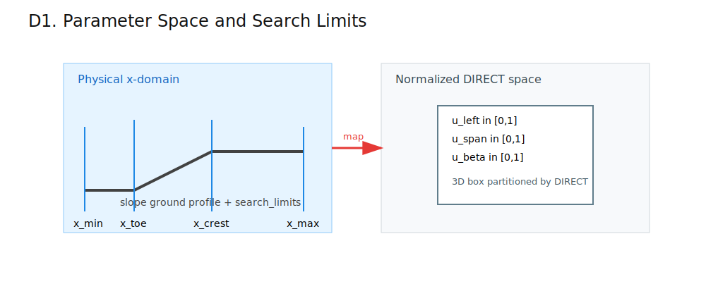
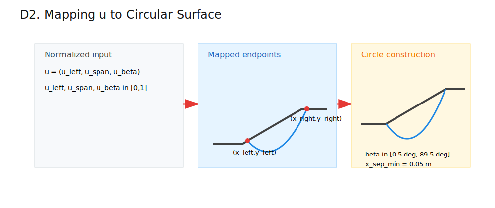
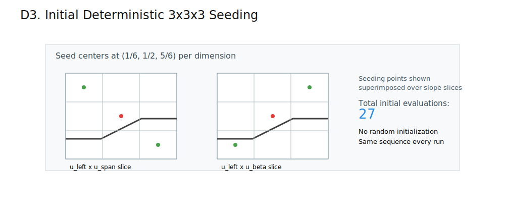
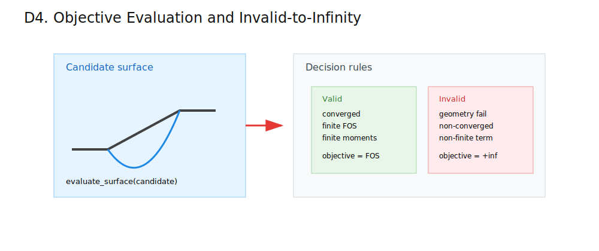
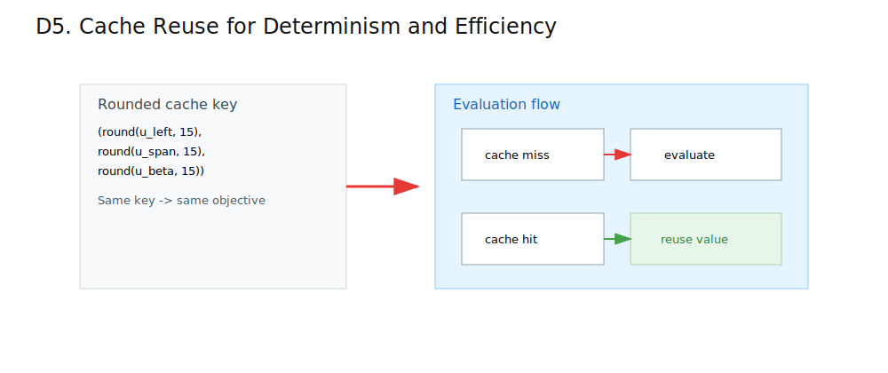
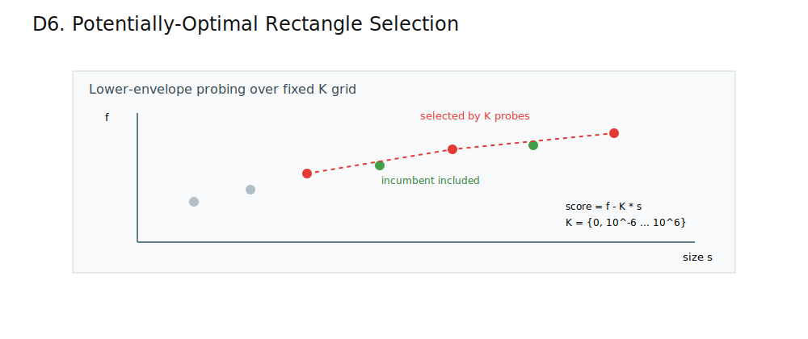
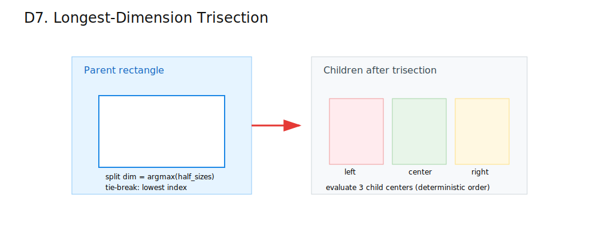
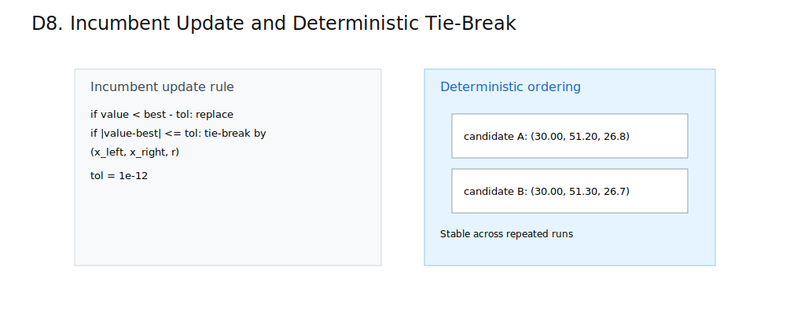
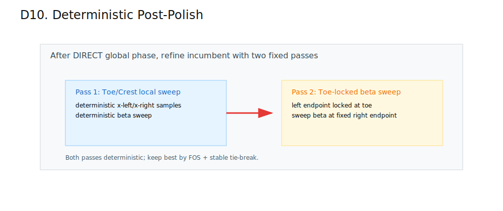

# DIRECT Global Circular Search Explained (Super Simple)

This document explains the current implementation in `src/slope_stab/search/direct_global.py`.

Goal in one sentence: run a deterministic DIRECT-style global search over circular surface parameters, then apply deterministic local polishing.

## Legend (Used in All Diagrams)

- Ground/profile/axes: dark gray (`#424242`)
- Active search domain: light blue (`#E6F4FF`)
- Selected/active elements: red (`#E53935`)
- Deterministic accepted/incumbent elements: green (`#43A047`)
- Discarded/neutral context: muted gray (`#B0BEC5`)
- Warning/constraint emphasis: amber (`#EF6C00`, `#FFE082`)

## DIRECT Process: Diagram by Diagram

### D1. Parameter Space and Search Limits

Short description: define physical x-limits and the normalized 3D DIRECT space.

Formulas:

`x in [x_min, x_max]`  
`u = (u_left, u_span, u_beta) in [0,1]^3`

- What this computes: bounded physical domain and normalized search coordinates.
- Where it is used in implementation: `run_direct_global_search` and `_map_to_surface`.

### D2. Map `u` to Circular Surface

Short description: convert normalized coordinates to endpoints and beta, then build the circle.

Formulas:

`x_left = x_min + u_left * ((x_max - x_min) - x_sep_min)`  
`x_right = x_left + x_sep_min + u_span * (x_max - x_left - x_sep_min)`  
`beta = beta_min + u_beta * (beta_max - beta_min)`

Key v1 constants:

`x_sep_min = 0.05 m`  
`beta range = [0.5 deg, 89.5 deg]`

- What this computes: one candidate circular surface from one normalized point.
- Where it is used in implementation: `_map_to_surface`, `_circle_from_endpoints_and_tangent`.

### D3. Deterministic 3x3x3 Initialization

Short description: seed the domain with 27 deterministic centers before iterative DIRECT updates.

Formula:

`centers_1d = {1/6, 1/2, 5/6}`  
`initial_centers = centers_1d^3` (27 points)

- What this computes: broad deterministic startup coverage.
- Where it is used in implementation: initialization block in `run_direct_global_search`.

### D4. Objective Evaluation and Invalid-to-Infinity

Short description: evaluate Bishop FOS for valid candidates; map invalid/non-converged candidates to `+inf`.

Rule:

`objective = FOS` for valid converged finite result  
`objective = +inf` otherwise

- What this computes: robust black-box objective for DIRECT.
- Where it is used in implementation: `evaluate_point` inside `run_direct_global_search`.

### D5. Cache Reuse

Short description: round normalized coordinates and reuse exact prior evaluations.

Formula:

`key = (round(u_left,15), round(u_span,15), round(u_beta,15))`

- What this computes: deterministic, repeatable memoization.
- Where it is used in implementation: `cache` lookup/store in `evaluate_point`.

### D6. Potentially-Optimal Selection

Short description: choose candidate rectangles via deterministic lower-envelope probing on fixed `K` values.

Formula:

`score = f - K * s`, where `s = max(half_sizes)`  
`K in {0, 10^-6, ..., 10^6}`

- What this computes: rectangles eligible for subdivision this iteration.
- Where it is used in implementation: `_best_rect_per_size`, `_select_potentially_optimal`.

### D7. Longest-Dimension Trisection

Short description: split each selected rectangle on its longest dimension into left/center/right children.

Rules:

`split_dim = argmax(half_sizes)`  
Tie-break: lowest index dimension

- What this computes: deterministic spatial refinement.
- Where it is used in implementation: subdivision loop in `run_direct_global_search`.

### D8. Incumbent Update and Tie-Break

Short description: update best-so-far FOS with stable tie handling.

Rules:

If `value < best - tol`, replace incumbent.  
If tied within `tol`, compare key `(x_left, x_right, r)`.

`tol = 1e-12`

- What this computes: deterministic incumbent state.
- Where it is used in implementation: incumbent update in `evaluate_point`.

### D9. Stopping Criteria

Short description: terminate when the first configured stopping condition is met.

Stop on first hit:

- `max_iterations`
- `max_evaluations`
- incumbent size `<= min_rectangle_half_size`
- improvement over `stall_iterations` `< min_improvement`

- What this computes: termination reason and final DIRECT iteration trace.
- Where it is used in implementation: stop checks in `run_direct_global_search`.

### D10. Deterministic Post-Polish

Short description: apply two deterministic local refinement passes after global DIRECT search.

Passes:

1. Toe/crest local sweep  
2. Toe-locked beta sweep

- What this computes: final polished governing circular surface.
- Where it is used in implementation: `_run_toe_crest_refinement`, `_run_toe_locked_beta_refinement` calls near the end of `run_direct_global_search`.

## Output Diagnostics

`search` metadata for `direct_global_circular` includes:

- config payload (`max_iterations`, `max_evaluations`, `min_improvement`, `stall_iterations`, `min_rectangle_half_size`, `search_limits`)
- `total_evaluations`
- `valid_evaluations`
- `infeasible_evaluations`
- `termination_reason`
- `iteration_diagnostics` items:
  - `iteration`
  - `total_evaluations`
  - `potentially_optimal_count`
  - `incumbent_fos`
  - `min_rectangle_half_size`

## Verification Gates

Hard benchmark gate for built-in direct-global benchmark cases:

`FOS(method) <= FOS(benchmark) + 0.01`

Applied to Cases 2-4 in `python -m slope_stab.cli verify`.

Additional hard guards in regression tests:

- finite positive FOS
- converged solve
- finite driving/resisting moments
- valid winning surface metadata
- deterministic repeatability for repeated runs

## Deterministic Behavior

This method is deterministic because ordering is fixed for:

- initialization centers
- cache key rounding
- potentially-optimal selection over fixed `K` grid
- split dimension tie-break
- incumbent tie-break key
- post-polish sweep ordering

No random-seed field is used for this direct-global path.

## If Diagrams Do Not Render

If your viewer cannot render SVG, the formulas and text are still valid.
Use a Markdown viewer with image support for best results.
